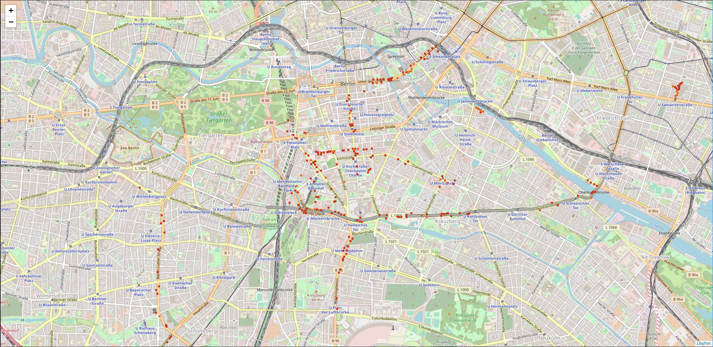

# IngressDataDumpExplorer
### About
IngressDataDumpExplorer is a set of tools that allows you to visually explore your Ingress gamedata exported by Niantic as part of their GDPR compliance.

### How to get the data
Simply write an E-Mail to `privacy@nianticlabs.com`:

> Dear Sir or Madam,  
> I'd like to request a dump of the raw data Niantic stores about my Ingress account @<account_name>, as regulated under GDPR.  
> Yours sincerely,  
> <your_name>

### How to use
You have to extract the password protected zip you got from Niantic into a new folder called `dump` inside this sourcetree. It must contain files like `game_log.tsv`.

You can then run this program in docker with the following commands:

```bash
docker build . -t dump-explorer              # Needed once
docker run -p 8080:8080 dump-explorer:latest # Launch
```

Afterwards, navigate to `localhost:8080` in your favorite web browser (I only tested with Google Chrome).



---

**Notice:** For now, you first need to execute the following command once, to fix the format errors in Niantic's dump. This will be integrated into the application in the future.

```bash
sed -i 's/None\tNone$/None/g' game_log.tsv
```

### License

    IngressDataDumpExplorer, a set of tools to explore your Ingress gamedata
    Copyright (C) 2018  Maxr1998

    This program is free software: you can redistribute it and/or modify
    it under the terms of the GNU General Public License as published by
    the Free Software Foundation, either version 3 of the License, or
    (at your option) any later version.

    This program is distributed in the hope that it will be useful,
    but WITHOUT ANY WARRANTY; without even the implied warranty of
    MERCHANTABILITY or FITNESS FOR A PARTICULAR PURPOSE.  See the
    GNU General Public License for more details.

    You should have received a copy of the GNU General Public License
    along with this program.  If not, see <http://www.gnu.org/licenses/>.